# Project Graph

This graph was generated locally from the current Astro project structure because the `graphifyy` MCP tool is not available in this session.

## App Graph

```mermaid
graph TD
  A[astro.config.mjs]
  B[src/pages/index.astro]
  C[src/layouts/Layout.astro]
  D[src/data/school.ts]
  E[src/styles/global.css]
  F[src/utils/assetUrl.ts]
  G[src/scripts/reveal.ts]
  H[src/scripts/motion-enhance.ts]
  I[src/shims/astro-prerender-entry.js]

  B --> C
  B --> J[BrandHeader]
  B --> K[Navbar]
  B --> L[Hero]
  B --> M[PosterSlider]
  B --> N[NoticeBoard]
  B --> O[About]
  B --> P[PrincipalMessage]
  B --> Q[AcademicLevels]
  B --> R[AcademicHighlights]
  B --> S[WhyChooseUs]
  B --> T[Facilities]
  B --> U[Faculty]
  B --> V[AdmissionsCta]
  B --> W[Gallery]
  B --> X[ParentFormCTA]
  B --> Y[Location]
  B --> Z[Footer]

  C --> D
  C --> E
  C --> G
  C --> H

  L --> D
  L --> F
  L --> AA[AcademicDoodles]

  M --> D
  M --> F

  N --> D
  O --> D
  O --> AA
  P --> D
  P --> AA
  Q --> D
  Q --> AA
  R --> D
  R --> AA
  S --> D
  T --> D
  U --> D
  V --> D
  W --> D
  W --> F
  W --> AA
  X --> D
  Y --> D
  Y --> AA
  Z --> D

  A --> I
```



## Data Flow

```text
school.ts
  -> SEO metadata in Layout
  -> navigation labels and CTA destinations
  -> homepage section copy and visibility
  -> notice/poster/gallery datasets
  -> footer/contact/social details

assetUrl.ts
  -> normalizes public asset paths against Astro BASE_URL
  -> used by Hero, PosterSlider, Gallery

global.css
  -> shared tokens, motion, cards, buttons, poster, gallery, FAB styles

reveal.ts
  -> reveal-on-scroll
  -> sticky navbar state
  -> scroll-to-top FAB
  -> active nav section highlighting

motion-enhance.ts
  -> optional tilt/magnetic/parallax enhancements
```

## Homepage Render Order

```text
Layout
  BrandHeader
  Navbar
  Hero
  PosterSlider
  NoticeBoard
  About
  PrincipalMessage
  AcademicLevels
  AcademicHighlights
  WhyChooseUs
  Facilities
  Faculty
  AdmissionsCta
  Gallery
  ParentFormCTA
  Location
  Footer
```
